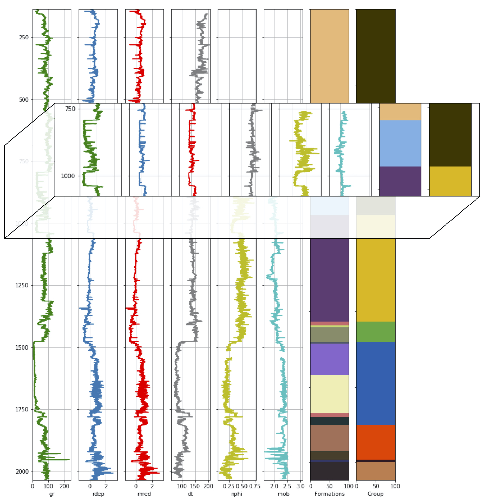
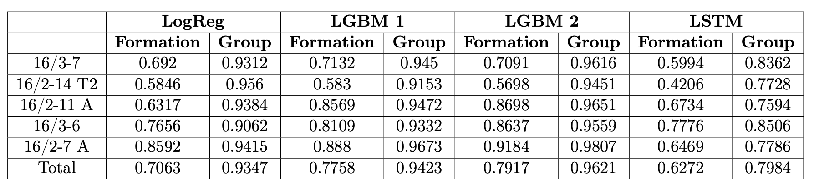
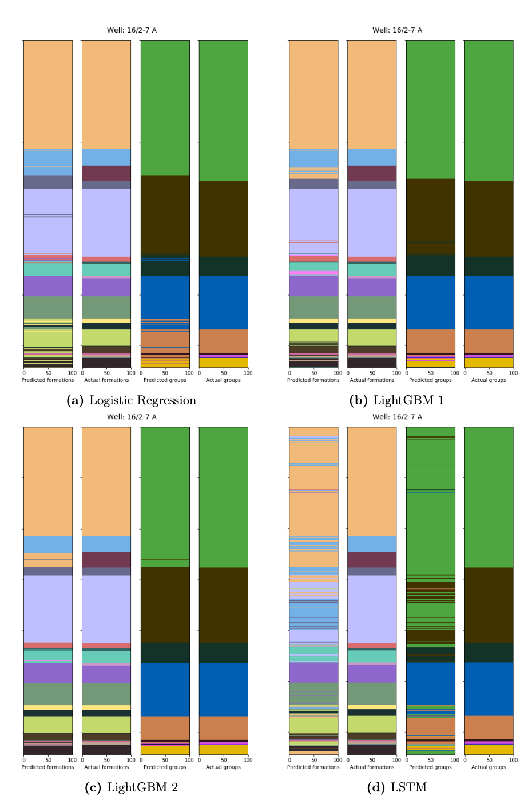
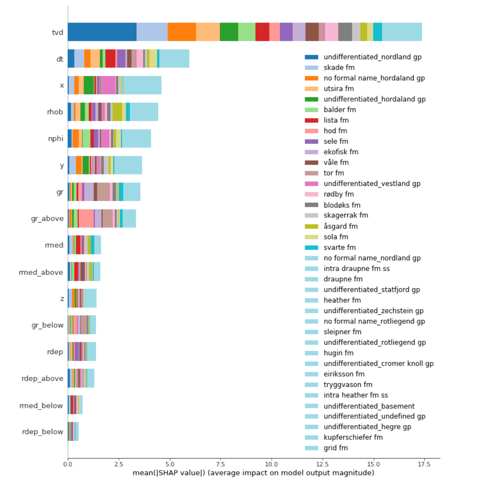
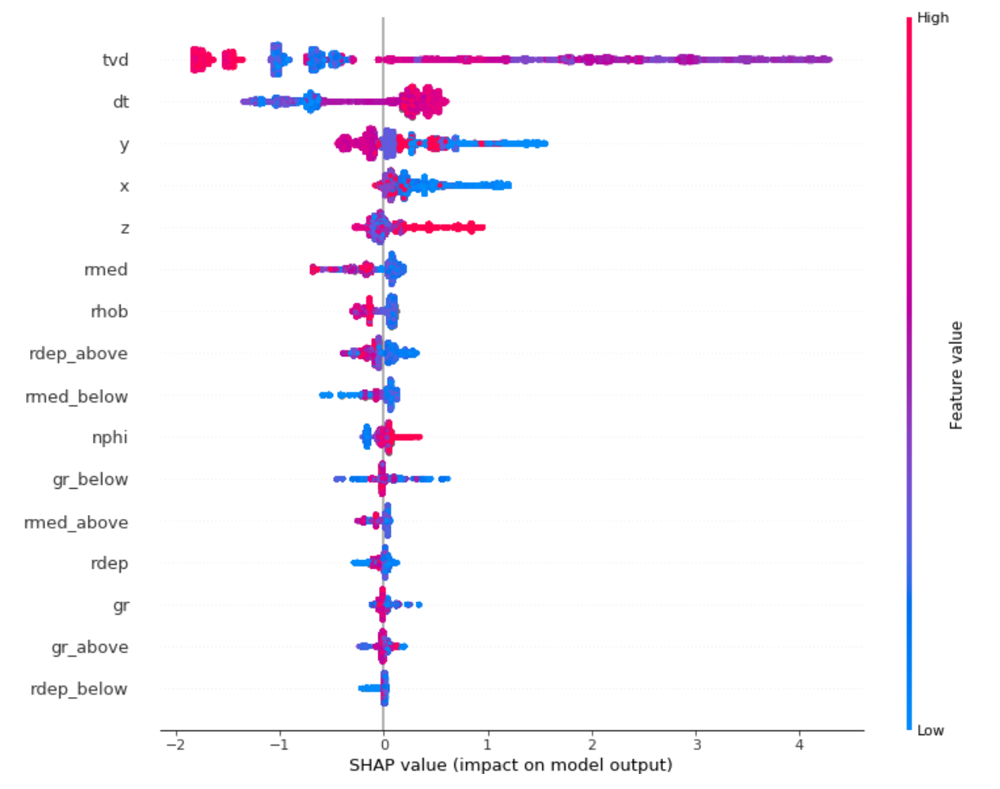

# Machine learning for automated stratigraphy classification

## Thesis Summary
**Title:** "*Machine learning for automated stratigraphy classification*"

**Authors:** Petter Søland ([psoland](https://github.com/psoland)), Mikkel Vatne Thue ([MikkelVT](https://github.com/MikkelVT))

This thesis was written as a part of the Master of Science in Economics and Business Administration, with a major in Business Analytics, at the Norwegian School of Economics (NHH). It is written with the intent that it should be both intuitive and insightful for decision-makers working in the drilling industry with little ML knowledge, and for technically skilled individuals with less domain knowledge.

The content posted in this repository is not meant to be directly implemented in its current form, but rather to be used as an inspiration to further research on the topic of ML and labeling of sedimentary rocks. The data sets used to train our models are not made public due to copyright restrictions.

This is only a short summary of our thesis where the most interesting results and findings are included. The complete thesis can be found in the repository under the name 
["Machine learning for automated stratigraphy classification.pdf"](https://github.com/pro-well-plan/thesis_stratigraphy_prediction_2019/blob/master/Machine%20learning%20for%20automated%20stratigraphy%20classification.pdf)

---
## Abstract
This thesis explored to what extent different supervised machine learning algorithms can be used to label subsurface formations in wells. It was explored through empirical study using wireline logs from the Johan Sverdrup field as inputs. The results from four different machine learning models were compared; two LightGBM models, one LSTM model and a Logistic Regression model as a benchmark. The data set consisted of 31 wells in the Johan Sverdrup field with a total of 406 666 labeled observations and the corresponding measured properties at different depth points in the wells.

The two LightGBM models both performed better than the benchmark. The results obtained from the neural network were significantly worse than both LightGBM models and the benchmark. Due to time- and computational constraints, we were not able to fully utilize the potential of the neural network (LSTM). Hence, additional tuning and model stacking could potentially lead to improved results.

The best performing model was LightGBM 2, the model that utilized a stratified  training- and validation split. Here, sequential observations from the same well were randomly split across the training- and validation data. This model yielded an accuracy of 79.17%. However, this model overfitted significantly to the training- and validation data. Further, LightGBM 1, the model that utilized a customized stratified training- and validation split, had a slightly lower accuracy of 77.58%. Here, all sequential observations from the same well were kept in the same data set, which caused significantly less overfitting to the training- and validation data. Based on this, we concluded that out of the models tested in the thesis, LightGBM 1 had the highest potential to generalize on unseen data.

The classification accuracy of around 80%, and the insight gained from the interpretable machine learning method, can be of great contribution and create significant value to experts currently performing the labeling of the formations in a manual fashion.

---

## Problem Summary

The cost of uncertainties related to the stratigraphy of a well, can be huge. Through firsthand experience and extensive market research, Magnus Tvedt (CEO of PWP), has found that if a drilling-company is given inadequate or wrongful information about the stratigraphic layers of a well, it can cause errors resulting in 1-7 days of downtime. Each day of downtime will, on average, cost 5 million NOK. Furthermore, lousy stratigraphy interpretation can lead to a well design that is sub-optimal or even result in failure. If a well design fails, the negative economic impact will result in added costs of hundreds of millions of NOK. As previously discussed, making the drilling industry faster and more accurate would not only require a lot of data, but also a well-structured database where data is accessible and ready to be analyzed. Automatic stratigraphy interpretation through wireline logs will improve and streamline a very manual task, liberating experts to do other value-creating tasks, which will further improve the well design.

Because of the proved explanatory power of wireline logs, and sophisticated machine learning techniques’ ability to identify patterns in large amounts of data, it is interesting to examine how the application of such techniques can help automate today’s manual interpretation process. The main objective of this thesis was to explore different machine learning techniques’ ability to automatically identify unique subsurface structures in wells, using wireline logs as input.

In the Figure below, we have highlighted a subsection in order to illustrate the connection between wireline logs and formations in a well. As can be seen in the highlight, the values of *gr*, *rdep*, *rmed*, and *nphi* change as the formation changes. In this case, we can see a significant drop in the values of the above-mentioned logs. However, in some cases, the change might be more complex or subtle. The goal of the thesis was to investigate the extent to which machine learning models are able to learn the patterns and other information from the wireline logs, in order to correctly label the formations.

---

## Data

Because the ML-models only can learn from the input given to them, the data wrangling and restructuring was one of the most crucial parts when working on the thesis. The structure of the data sets, the feature engineering, and the choices made when it comes to the processing will affect the models' credibility directly. Descriptive statistics where analysed thoroughly in order to make the correct decisions with regards to the structure, cleaning, and the feature engineering of the data.

The problem was addressed empirically, using well-data from the Johan Sverdrup field. All of the methods used in the thesis were implemented in Jupyter Notebooks, using the Python programming language, in Amazon Web Services (AWS). The code written for this thesis can be found in this GitHub repository. Originally, these data sets included several different wireline logs, but only a handful of logs were consistently collected across for all wells.

After doing some data exploration, we were left with nine input features; True vertical depth **(tvd)**, latitude **(lat)**, longitude **(long)**, Gamma ray log **(gr)**, Medium Resistivity Log **(rmed)**, Deep Resistivity Log **(rdep)**, Sonic log **(dt)**, Neutron porosity log **(nphi)**, and Density log **(rhob)**. Our models were measured on how well they classified our target variable **formations**. To add extra understanding to our models' predictive power, **groups** was also considered as an additional evaluation criteria.

### Feature engineering
With a goal of improving the predicting power of the models, we applied  different measures of feature engineering. Since a lot of the algorithms use Euclidean distance between two data points, the algorithms only take in the magnitude of the feature and neglect the units which can cause problems for some ML algorithms. As a result, the input features was scaled.

Since longitude and latitude represent a three- dimensional space, the highest and lowest value will, in reality, be close to each other. However, this would not be picked up by a machine learning algorithm, meaning that simply using longitude and latitude for machine learning might cause a problem. To solve this, we mapped longitude and latitude to x, y, and z coordinates.

Considering the way rock-formations are formed where formations close to each other are likely to depend on each other, as previously discussed, it could be beneficial for the models to have access to information about the other observations. In order to potentially increase the predicting power, we experimented with the inclusion of some of the features from the observation above and below. For instance, an observation at row 30 would also be fed the gamma ray value for the observation at row 29 and 31.

---
## Training-, validation-, and test-split

To properly validate our models our dataset was structured in a train/validation/test split. For this particular problem it was quite challenging to ensure that the three data sets had a realistic distribution of the formations in order to avoid overfitting. This is normally done by using a stratified split, a simple function in the Python programming language.

However, since the goal of the thesis was to predict rock-formations, we needed to consider the fact that these formations have developed over thousands of years. Younger layers are established over older layers, meaning the sequence of the formations matters as the younger layers will depend on the older layers and vice versa. This makes the depth-vise sequential information and the location of the well very important when trying to predict rock-formations for each given depth-point of a well.

It also means that since the features in each row in a well usually only have a relatively small percentage change from the observation above and below, a normal stratified split would indirectly reveal information about the target variable through the validation process, by spreading observations from the same well across all data sets. The test set, the data set that is supposed to be representing how the data would be obtained and predicted in "real life", would now contain information from wells that are also present in train- and validation data. In other words, if we were to evaluate our models based on a test set that had been stratified in the normal way, we would have obtained artificially good results that would not have been representative of the actual predicting power of the models.

To overcome the challenge of splitting the data in so that the formations were correctly distributed, while simultaneously keeping the wells intact, we designed our own solution. This solution was heavily inspired by this StackOverflow-post: ["StratifiedGroupShuffleSplit"](https://stackoverflow.com/questions/56872664/complex-dataset-split-stratifiedgroupshufflesplit).

#### Customized Stratified Train/Test Split
The designed solution first calculated the percentage-distribution of the formations in the total data set. This was then used as a target in which the wells were assigned to either the train- validation- or test set, depending on both the percentage-distribution of the formations in the given well and the number of wells already assigned to the respective data sets. The function would make sure that the correct percentage of wells would be distributed across the three data sets, while at the same time keeping an even distribution of formations. This way of splitting the data set led to a train set with 17 unique wells, a validation set with 9 unique wells, and a test set with 5 unique wells. This split, with these exact wells, was consistently used as a starting point for all of our models discussed in the thesis. The python code for the customized solution can be found in this GitHub repository under the name ["Functions.ipynb"](https://github.com/pro-well-plan/thesis_stratigraphy_prediction_2019/blob/master/Functions.ipynb).

Lastly, we would like to emphasise the focus we have had on keeping a set of test wells completely separate from our models that were identical for all models. This is a crucial step regardless of which ML-technique you are applying, but since we have experimented with different degrees ways of splitting the data, it was especially important this thesis. Without testing the models on completely blind wells, we would neither be able to obtain reliable performance measures nor compare our results across models.

Extensive data wrangling was performed to clean and restructure the data sets to be ready for analysis, we kindly refer to the full thesis for a detailed explanation on how this was done. The code written for this purpose can be found in this repository under the name ["Functions.ipynb"](https://github.com/pro-well-plan/thesis_stratigraphy_prediction_2019/blob/master/Functions.ipynb).

---
## Results

*Accuracy for all models on blind wells*

The total accuracy illustrated in the Table above, shows that the models were able to pick up meaningful formation-patterns by combining information from different wireline logs. On a group-level, all models, except for LSTM, managed to predict formations placed in the same group remarkably accurate, with the best model yielding an average accuracy of 96%. However, on a formation-level, the differences between the models become more prominent, with total accuracies ranging from 63-79%. For all wells, the top part was predicted quite accurately, and because about 1/3 of the wells consisted of the same formation, this boosted the accuracy significantly. As we moved further down the wells, the models had more trouble differentiating between similar formations within the same group. In general, if we consider all the models’ predictions for all blind wells (an illustration can be found in Appendix A5 in the full thesis), there is a clear trend that the transition-points are the most difficult segments to predict, especially for the lower, more fragmented, part of the wells.

*Well 16/2-7 A - Predicted vs actual formation and group for all models. Each color represents a unique formation and group. The figure illustrates the areas in which the model predicted correctly and where the model was not able to make the right predictions.*

To illustrate this trend, we have included a summary of all the models’ predictions for well 16/2-7 A the Figure above. The Figure shows how most of the models were able to separate between similar formations with high accuracy. Further, it is very impressive to see how precise the LightGBM 2 model (c) was able to label the long- to mid-length sequences of the well, and even more so for the precise labeling of the transition-points between each formation for the lower, more fragmented part of the well.

## Interpretable ML - SHAP
Going further, it is also interesting to take a closer look at how the model made its predictions. The package [SHAP](https://github.com/slundberg/shap) was utilized to analyze how the different input features influenced the models' predictions. SHAP helps us make automated calculations of additive feature importance. To show how SHAP can be used to interpret ML models' predictions, we have included an interpretation of the predictions one of the models made:

*The figure illustrates the SHAP feature importance for LightGBM 1, measured as mean absolute SHAP-values. The first 19 formation is represented by a unique color, the remaining 19 is represented by the turquoise color. True vertical depth was, accumulated for all formations, the most influential feature.*

The coloring in the Figure above indicates that, depending on which formation we are talking about, the individual features had a varying impact on the model output. Even though the fluctuations in predictive power for the unique formations were quite low, it is interesting to note that for formation skade fm, and especially undifferentiated nordland group, the depth measure was particularly important. High depth importance suggests that the two formations generally can be found at a specific depth range of the well. To further investigate such formation-characteristics, we took it a step further and plotted the feature importance for each variable against one of the formations with the highest sample frequency in our blind test data.

*The SHAP summary plot for LightGBM 1 illustrates the relationship between the original feature value and the impact on the predicted class skadefm. The feature impact is shown on the horizontal dispersion on the x-axis. The coloring of the points indicates if the original feature value was high (violet) or low (blue). As an example, a low original feature value for true vertical depth increase the models predicted probability of classifying the observation undifferentiated nordland gp. On the other hand, a high feature value for true vertical depth, would push the predicted probability for class undifferentiated nordland gp towards 0.*

Going further, we can take a look at the feature importance for the formation skade fm in the Figure above. Here, it is interesting to notice that all three location indicators x, y, and z is among the strongest predictors for skade fm. In other words, this formation seems to be location-specific. To summarize, certain locations given by x, y, and z, mid-range depth measures, and high values of dt, would make it very likely for the model to output skade fm as the predicted formation.

The most important takeaway from this is not necessarily the result it self, but how SHAP and interperetable ML can be used as an asset to gain a deeper understanding of how models utilize information from it's input features to make its predictions. This information can be of great assistance to engineers and geologists currently performing the labeling of the formations in a manual fashion. By utilizing the classification methods described, experts can spend more time on other value-creating tasks and gain a deeper understanding of the connection between wireline logs and subsurface formations.

We kindly refer to the [full thesis](https://github.com/pro-well-plan/thesis_stratigraphy_prediction_2019/blob/master/Machine%20learning%20for%20automated%20stratigraphy%20classification.pdf) for further details.

